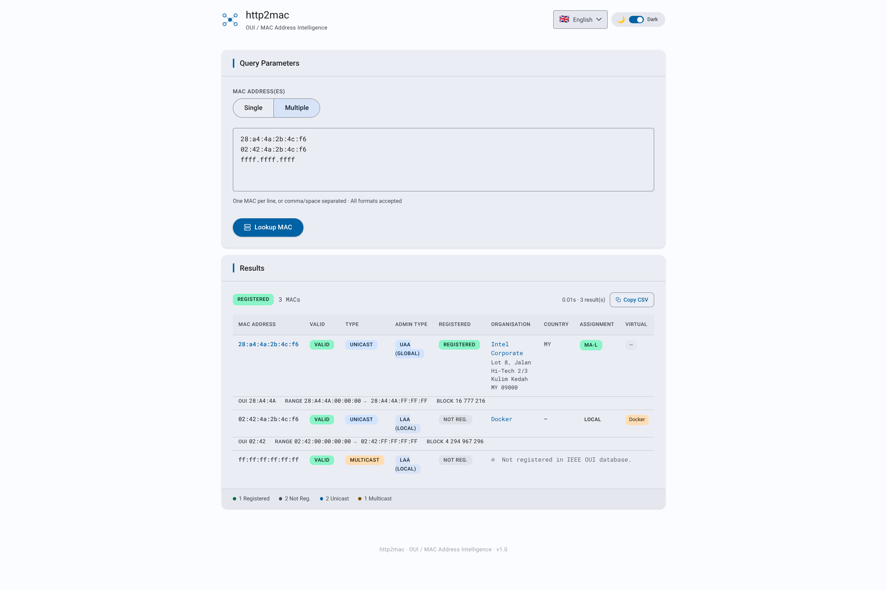

# http2mac

[](https://opensource.org/licenses/Apache-2.0)
[](https://hub.docker.com/r/letstool/http2mac)

> **MAC-over-HTTP** — Fast & lightweight HTTP gateway that serves MAC address OUI database as a JSON REST API.

Given one or more MAC addresses in any common format, **http2mac** returns the registered vendor, assignment block, country, and virtual-machine flag — served from an in-memory MMDB database that is refreshed automatically from a CDN.

---

## Screenshot



> The embedded web UI (served at `/`) provides an interactive form to check MAC addresses against the IEEE OUI database. It supports **dark and light themes** and is fully translated into **15 languages**.

---

## Releases

Provided binaries are fully functional natively on Linux (amd64 or arm64), Windows (amd64), macOS (amd64 or arm64), and also via Docker (amd64 or arm64), with no additional dependencies required. For download and installation, please refer to the [Releases](https://github.com/letstool/http2mac/releases) page.

---

## Disclaimer

This project is released **as-is**, for demonstration or reference purposes.
It is **not maintained**: no bug fixes, dependency updates, or new features are planned. Issues and pull requests will not be addressed.

---

## License

This project is licensed under the **Apache License, Version 2.0** — see the [`LICENSE`](LICENSE) file for details.

```
Copyright (c) 2026 letstool.net
```

## Why CDN

The first version of `http2mac` built its mmdb database directly from the IEEE OUI Project's [IEEE OUI](https://standards-oui.ieee.org/). While that approach worked, it raised a concern: thousands of instances polling the source site at their own schedule could place unnecessary load on that service.

To avoid that, I took the network load onto my own infrastructure. `http2mac` now fetches its data from a personal CDN (`cdn.letstool.net`) that I maintain and fund myself. The data is still sourced directly from IEEE OUI — nothing changes in terms of accuracy or freshness — but the CDN acts as a buffer, absorbing the traffic so that IEEE OUI doesn't have to. 

**The data itself is free.** Anyone can run `http2mac` without a `LICENSE_KEY` and get the same mac database, with no registration required.
 
---

## Features

- Single static binary — no external runtime dependencies
- Embedded web UI and OpenAPI 3.1 specification (`/openapi.json`)
- **Self-builds its own mmdb** from a gzipped CSV fetched from the **letstool CDN** (`https://cdn.letstool.net/mac/csv`) — no MaxMind account required
- **CDN-efficient**: uses `If-Modified-Since` / `304 Not Modified` to avoid redundant downloads when the data has not changed
- **Multiple MAC formats** – accepts `xx:xx:xx:xx:xx:xx`, `xx-xx-xx-xx-xx-xx`, `xx.xx.xx.xx.xx.xx`, `xxxx.xxxx.xxxx`, `xxxxxxxxxxxx`
- **Batch lookups** – query up to `MAC_MAX_MACS` addresses in a single POST
- **Rich response** – OUI owner, address range, block size, assignment type, country, virtual-machine attribution0
- **Computed fields** – `valid`, `type` (Unicast/Multicast), `admin_type` (UAA/LAA), `registered`
- Automatic database refresh **every 24 hours** (hardcoded); scheduler adapts to CDN signals:
  - **429** — deferred to the CDN `Retry-After` timestamp
  - **410** — retried after 24 h, 48 h, 72 h, 96 h, then stopped permanently
  - **401** — update process stopped immediately with the server's error message logged
- **`/db/mac` endpoint**: serves the current `mac.mmdb` for peer sync
- Configurable listen address, database path, update schedule, and IP batch limit
- Web UI available in **dark and light mode**, switchable at runtime
- Web UI fully translated into **15 languages**: Arabic (`ar`), Bengali (`bn`), German (`de`), English (`en`), Spanish (`es`), French (`fr`), Hindi (`hi`), Indonesian (`id`), Japanese (`ja`), Korean (`ko`), Portuguese (`pt-BR`), Russian (`ru`), Urdu (`ur`), Vietnamese (`vi`), Chinese (`zh-CN`)
- Right-to-left (RTL) layout for Arabic and Urdu, with automatic direction detection
- Docker image built on `scratch` — minimal attack surface

---

## How it works

```
Startup / Periodic update (every 24 hours, or adjusted on CDN signal)
       │
       ▼
GET https://cdn.letstool.net/mac/csv
  If-Modified-Since: <last seen>
  Authorization: Basic <LICENSE_KEY>  (if configured)
       │
       ├─ 304 Not Modified  → keep current DB, update timestamp, resume 24h cycle
       ├─ 429 Too Many Requests → log Retry-After, defer next attempt to that timestamp
       ├─ 410 Gone          → product disabled; retry in 24h → 48h → 72h → 96h → STOP
       ├─ 401 Unauthorized  → log server message, stop update process permanently
       └─ 200 OK → gzip-decompress → parse CSV → reset 410 counter
       │
       ▼
Parse CSV rows → one MAC Block per row
       │
       ▼
Build mac.mmdb via mmdbwriter (MaxMind-compatible format)
       │
       ▼
Atomic swap: serve new DB while old requests finish
       │
       ▼
POST /api/v1/mac  ──▶  mmdb lookup  ──▶  JSON response
```

The CSV (~57 000+ mac blocks) is fetched, decompressed on the fly, and compiled into an mmdb in a few seconds. `If-Modified-Since` prevents unnecessary downloads and CDN quota consumption when the data has not changed since the last fetch.

---

## Prerequisites

- [Go](https://go.dev/dl/) **1.24+**
- Outbound HTTPS access to `cdn.letstool.net` at startup and every 24 hours

---

## Build

### Native binary (Linux)

```bash
bash scripts/linux_build.sh
```

The binary is output to `./out/http2mac`.

The script produces a **fully static binary** (no libc dependency):

```bash
CGO_ENABLED=0 go build \
    -trimpath \
    -ldflags="-extldflags -static -s -w" \
    -o ./out/http2mac ./cmd/http2mac
```

### Windows

```cmd
scripts\windows_build.cmd
```

### Docker image

```bash
bash scripts/docker_build.sh
```

Two-stage Docker build:
1. **Builder** — `golang:1.24-alpine` compiles a static binary
2. **Runtime** — `scratch` image, containing only the binary and CA certificates

The resulting image is tagged `letstool/http2mac:latest`.

---

## Run

### Native (Linux)

```bash
bash scripts/linux_run.sh
```

### Windows

```cmd
scripts\windows_run.cmd
```

### Docker

```bash
bash scripts/docker_run.sh
```

Equivalent to:

```bash
docker run -it --rm \
  -p 8080:8080 \
  -v ./db:/data:rw \
  -e LISTEN_ADDR=0.0.0.0:8080 \
  letstool/http2mac:latest
```

On first run, the server fetches the gzipped CSV from the CDN, builds the mmdb, and starts serving. This takes a few seconds. Once running, the service is available at [http://localhost:8080](http://localhost:8080).

---

## Configuration

Each setting can be provided as a CLI flag or an environment variable. The CLI flag always takes priority. Resolution order: **CLI flag → environment variable → default**.

The database refresh interval is **fixed at 24 hours** and is not configurable. The scheduler adapts to CDN signals: a `429` defers the next attempt to the `Retry-After` unix timestamp; a `410` triggers a progressive backoff (24 h → 48 h → 72 h → 96 h) then a permanent stop; a `401` stops the update process immediately.

| Environment variable | CLI flag | Default | Description |
|---|---|---|---|
| `LISTEN_ADDR` | `-listen-addr` | `:8080` | TCP address to listen on |
| `MAC_DB_URL` | `-db-url` | `https://cdn.letstool.net/mac/csv` | CSV source URL (or peer `/db/mac`) |
| `MAC_DB_DIR` | `-db-dir` | working directory | Directory where `mac.mmdb` is stored |
| `MAC_MAX_MACS` | `-max-macs` | `100` | Maximum MAC addresses per request |

**Proxy environment variables** (no CLI flag — standard curl-compatible convention):

| Variable | Description |
|---|---|
| `HTTPS_PROXY` / `https_proxy` | Proxy URL for HTTPS requests (CDN and peer downloads). E.g. `http://proxy.corp:3128` or `socks5://proxy.corp:1080`. |
| `HTTP_PROXY` / `http_proxy`   | Proxy URL for plain HTTP requests. |
| `NO_PROXY` / `no_proxy`       | Comma-separated list of hosts or CIDRs to bypass the proxy (e.g. `localhost,10.0.0.0/8`). |

The proxy is configured using Go's standard `http.ProxyFromEnvironment` — identical behaviour to curl. The effective proxy URL is logged at startup.

**Examples:**

```bash
# Default mode: fetch from CDN anonymously every 6 hours
./out/http2mac -listen-addr 0.0.0.0:8080

# CDN mode through a corporate HTTP proxy
HTTPS_PROXY=http://proxy.corp:3128 ./out/http2mac

# CDN mode through a SOCKS5 proxy
HTTPS_PROXY=socks5://proxy.corp:1080 ./out/http2mac

# Peer mode: sync from an upstream instance
./out/http2mac -db-url http://upstream-host:8080

# Using environment variables (peer mode)
MAC_DB_URL=http://upstream-host:8080 ./out/http2mac

# Custom database directory
MAC_DB_DIR=/opt/macdb ./out/http2mac
```

---

## Database management

On startup, the server checks whether a cached `mac.mmdb` exists in `MAC_DB_DIR` and whether it is still within the configured refresh interval. If the database is absent or too old, it triggers an immediate update.

The update strategy depends on whether `MAC_DB_URL` is set:

### Mode 1 — CDN CSV build (default, `MAC_DB_URL` unset)

The server fetches a gzipped CSV from the letstool CDN:
```
GET https://cdn.letstool.net/mac/csv
If-Modified-Since: <previous Last-Modified>
```

The CDN responds with:
- **200 OK** — gzipped CSV; parsed and compiled into `mac.mmdb`. The 410 retry counter is reset to zero.
- **304 Not Modified** — data unchanged; current DB is kept, timestamp updated (no quota consumed)
- **429 Too Many Requests** — rate-limited; the `Retry-After` header (unix timestamp) is logged; next update deferred to that timestamp
- **410 Gone** — the product is currently disabled on the CDN; the scheduler retries after 24 h, then 48 h, 72 h, 96 h. If the 5th consecutive attempt still returns 410, the update process is stopped permanently. A successful 200 at any point resets the retry counter.
- **401 Unauthorized** — the `LICENSE_KEY` does not grant access to this product; the server message is logged and the update process is stopped permanently. Check your `LICENSE_KEY` / `-license-key` configuration.

The `Last-Modified` value from each 200 response is stored in `.last_modified_mac` and sent as `If-Modified-Since` on subsequent requests to avoid redundant downloads.

### Mode 2 — Peer sync (`MAC_DB_URL` set)

The server downloads `mac.mmdb` directly from the `/db/mac` endpoint of another running `http2mac` instance. No CDN access is needed. Useful for:
- Air-gapped or restricted environments
- High-availability clusters where only one node fetches from the CDN
- Reducing CDN quota consumption

```bash
./out/http2mac -db-url http://upstream-host:8080
```

In both modes, the database is refreshed **every 24 hours**. CDN-specific signals (429, 410, 401) only affect CDN CSV build mode; peer mode retries on the normal 24-hour interval regardless. Atomic hot-swap guarantees zero downtime during updates.

---

## API Reference

### `POST /api/v1/lookup`

Checks one or more MAC addresses against the IEEE OUI database.

#### Single MAC

```bash
curl -s -X POST http://localhost:8080/api/v1/lookup \
  -H 'Content-Type: application/json' \
  -d '{"mac":"00:11:22:33:44:55"}'
```

#### Batch

```bash
curl -s -X POST http://localhost:8080/api/v1/lookup \
  -H 'Content-Type: application/json' \
  -d '{"macs":["00:11:22:33:44:55","AABB.CCDD.EEFF"]}'
```

#### Response

```json
{
  "status": "SUCCESS",
  "macs": [
    {
      "mac": "00:11:22:33:44:55",
      "valid": true,
      "type": "Unicast",
      "admin_type": "UAA",
      "registered": true,
      "oui": "00:11:22",
      "organisation_name": "CIMSYS Inc",
      "organization_address": "Daejeon KR",
      "country_code": "KR",
      "address_min": "00:11:22:00:00:00",
      "address_max": "00:11:22:ff:ff:ff",
      "block_size": 16777216,
      "assignment": "MA-L",
      "virtual": "False"
    }
  ]
}
```

#### Status values

| `status` | Meaning |
|---|---|
| `SUCCESS` | At least one MAC was found in the OUI database |
| `NOTFOUND` | Request was valid but no MAC matched |
| `ERROR` | Malformed request, DB not ready, or server error |

### `GET /db/mac`

Streams the raw `mac.mmdb` binary. Used by peer instances (`MAC_DB_URL`).

---

## Response Fields

| Field | Type | Description |
|---|---|---|
| `mac` | string | Input MAC, normalised to `xx:xx:xx:xx:xx:xx` |
| `valid` | bool | `true` if the MAC address has a valid format (6 bytes, hex) |
| `type` | string | `"Unicast"` or `"Multicast"` (LSB of first octet) |
| `admin_type` | string | `"UAA"` or `"LAA"` |
| `registered` | bool | `true` if found in MA-L, MA-M, MA-S, CID or IAB blocks |
| `oui` | string | The OUI prefix (`xx:xx:xx`) |
| `organisation_name` | string | Registered vendor name |
| `organization_address` | string | Vendor address string |
| `country_code` | string | ISO 3166-1 alpha-2 country code |
| `address_min` | string | First MAC in the block |
| `address_max` | string | Last MAC in the block |
| `block_size` | uint64 | Number of addresses in the block |
| `assignment` | string | `MA-L`, `MA-M`, `MA-S`, `CID`, `IAB`, or other |
| `virtual` | string | `"False"` or the hypervisor name (e.g. `"VMware"`) |

---

## Database

http2mac converts the IEEE OUI CSV into a **MaxMind MMDB** using a compact IPv6 keyspace:

```
IPv6 key = fd:ac:db:00:00:00:00:00:00:00 | MAC[0] | MAC[1] | MAC[2] | MAC[3] | MAC[4] | MAC[5]
```

Each block is stored as a CIDR where the prefix length encodes the block size:

```
prefix_bits = 48 - log₂(block_size)
CIDR prefix = /80 + prefix_bits
```

| Assignment | Block size | CIDR |
|---|---|---|
| MA-L | 16 777 216 | /104 |
| MA-M | 1 048 576 | /108 |
| MA-S | 4 096 | /116 |

---

## Development

```bash
# Tidy dependencies
bash scripts/000_init.sh

# Build native binary
bash scripts/linux_build.sh

# Run
bash scripts/linux_run.sh

# Smoke tests (server must be running)
bash scripts/999_test.sh
```

---

## AI-Assisted Development

This project was developed with the assistance of **[Claude Sonnet 4.6](https://www.anthropic.com/claude)** by Anthropic.

---

## Attribution

Data sourced from the [IEEE OUI](https://standards-oui.ieee.org/). This project is not affiliated with or endorsed by the IEEE Project.

---

## See also 

| Project | GitHub | Docker Hub | Description |
|---|---|---|---|
| `http2dns` | [letstool/http2dns](https://github.com/letstool/http2dns) | [letstool/http2dns](https://hub.docker.com/r/letstool/http2dns) | Fast & lightweight HTTP gateway that serves DNS queries as a JSON REST API |
| `http2whois` | [letstool/http2whois](https://github.com/letstool/http2whois) | [letstool/http2whois](https://hub.docker.com/r/letstool/http2whois) | Fast & lightweight HTTP gateway that serves WHOIS queries as a JSON REST API |
| `http2geoip` | [letstool/http2geoip](https://github.com/letstool/http2geoip) | [letstool/http2geoip](https://hub.docker.com/r/letstool/http2geoip) | Fast & lightweight HTTP gateway that serves IP geolocation database as a JSON REST API |
| `http2cert` | [letstool/http2cert](https://github.com/letstool/http2cert) | [letstool/http2cert](https://hub.docker.com/r/letstool/http2cert) | Fast & lightweight HTTP gateway that serves X.509 certificate inspection as a JSON REST API |
| `http2tor` | [letstool/http2tor](https://github.com/letstool/http2tor) | [letstool/http2tor](https://hub.docker.com/r/letstool/http2tor) | Fast & lightweight HTTP gateway that serves Tor IP database as a JSON REST API |
| `http2sun` | [letstool/http2sun](https://github.com/letstool/http2sun) | [letstool/http2sun](https://hub.docker.com/r/letstool/http2sun) | Fast & lightweight HTTP gateway that serves solar position algorithm as a JSON REST API |
| `http2mac` | [letstool/http2mac](https://github.com/letstool/http2mac) | [letstool/http2mac](https://hub.docker.com/r/letstool/http2mac) | Fast & lightweight HTTP gateway that serves MAC address OUI database as a JSON REST API |
| `http2country` | [letstool/http2country](https://github.com/letstool/http2country) | [letstool/http2country](https://hub.docker.com/r/letstool/http2country) | Fast & lightweight HTTP gateway that serves country database as a JSON REST API |
| `http2prefix` | [letstool/http2prefix](https://github.com/letstool/http2prefix) | [letstool/http2prefix](https://hub.docker.com/r/letstool/http2prefix) | Fast & lightweight HTTP gateway that serves Internet BGP routing database as a JSON REST API |
